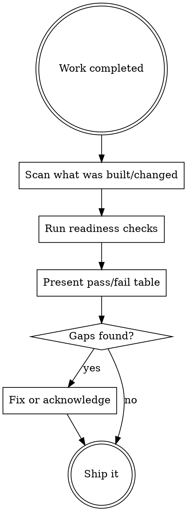

# Ship Ready

The "did you skip the boring part?" check. Runs before you call something done.

## When to Trigger

**Proactive (Claude invokes automatically):**
- After completing a feature, project phase, or deployment
- Before claiming a task is "done" or "shipped"
- After any work that touches production or shared infra

**Manual:** `/ship-ready` or `/ship-ready <project-dir>`

## Process



## Check Categories

Only check what's relevant to the scope of work. A small script doesn't need ops checks.

### Completeness
- [ ] Tests exist for new functionality (not just "it works when I run it")
- [ ] Error handling for external inputs (API calls, user input, file I/O)
- [ ] Edge cases considered (empty input, network failure, timeout)
- [ ] Happy path AND failure path tested

### Maintainability
- [ ] Key decisions captured (in commit messages, code comments, or README)
- [ ] Non-obvious logic has comments explaining WHY, not WHAT
- [ ] Could future-you understand this in 3 months without context?
- [ ] No dead code, commented-out blocks, or TODO landmines

### Operability
- [ ] How does it fail? Is the failure mode clear or silent?
- [ ] Logs exist for debugging (not just print statements)
- [ ] Restart/recovery path is clear
- [ ] Health check or status command exists for services

### Secrets Hygiene
- [ ] No hardcoded credentials
- [ ] .env in .gitignore
- [ ] Secrets location documented (where, not what)
- [ ] API keys scoped to minimum permissions

### Dependency Clarity
- [ ] requirements.txt / package.json / pyproject.toml up to date
- [ ] Setup steps reproducible (clone → install → run works)
- [ ] Python venv or node_modules in .gitignore
- [ ] Pinned versions for critical dependencies

## Output Format

Pass/fail table. Only show gaps.

```
| Check | Status | Action |
|-------|--------|--------|
| Error handling for API calls | missing | Add try/except around requests to external services |
| .env in .gitignore | missing | echo ".env" >> .gitignore |
| Recovery path | unclear | Add restart instructions to README or comments |
```

If everything passes: "Ship ready — nothing skipped." One line.

## Scaling by Scope

**Small script/utility:** Completeness + Secrets only.
**Feature/phase:** All categories, light touch on Operability.
**Deployment/service:** All categories, deep on Operability.

Don't over-audit small things. Match the check depth to the blast radius.

## The Bus Test

Core question: "If I disappear for 3 months and come back, or someone else needs to touch this — would they be lost?"

This isn't about perfect docs. It's about:
- Can they run it? (dependency clarity)
- Can they understand it? (maintainability)
- Can they fix it when it breaks? (operability)

## Tone

Table. Terse. Actionable. No guilt about missing docstrings. Focus on things that will actually bite you.
